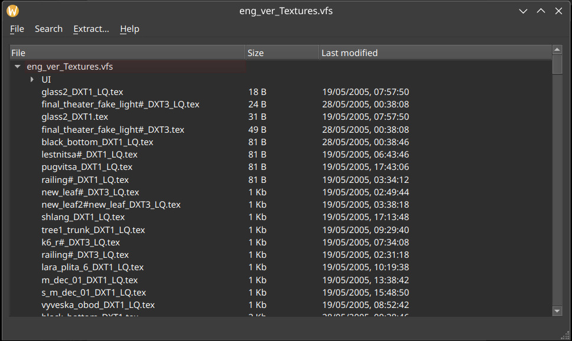

[ **English** ] [ [Русский](./README_ru.md) ]

# VFS Explorer
A graphic tool for previewing and extracting files stored in VFS archives, such as those used in Pathologic 1.


[](https://github.com/isatsam/vfs_explorer/actions/workflows/linux_dev.yml)[](https://github.com/isatsam/vfs_explorer/actions/workflows/windows_dev.yml

# Features
- List contents of a VFS archive, with all subdirectories
- Pick and choose which files or subdirectories to extract
- Search through files by filenames
- Interface available in English and Russian languages

# Usage
Download a stable release for your operating system from [Releases](https://github.com/isatsam/vfs_explorer/releases/latest).
If there is no release for your OS, or you would like to run a development version, see [instructions](./Development.md#Developing) on how to run VFS Explorer from source.

# plaguevfs
`plaguevfs` is a library for parsing, searching, and unpacking .VFS archives shipped with all versions of Pathologic 1
(2004 to 2015), as well as handling individual files from inside the archives and subdirectories.
Although the code aims to be as self-explanatory as possible, there's currently little to no documentation for the library.
## cli.py
cli.py is a tool for using `plaguevfs` library from the command line.
```py
$ python cli.py --help
usage: cli.py [-h] [-a ARCHIVE] [-s SEARCH] [-x EXTRACT] [--extract_all]

options:
  -h, --help            show this help message and exit
  -a ARCHIVE, --archive ARCHIVE
                        path to the .VFS archive
  -s SEARCH, --search SEARCH
                        search for a filename (recursive)
  -x EXTRACT, --extract EXTRACT
                        extract a file by filename
  --extract_all         unpack the whole .VFS archive at once
```

# Credits
- somevideoguy and EGBland for their research on Pathologic's VFS format, available [here](https://github.com/somevideoguy/pathologic)
- Friends Mario & Jon for through testing and bug catching

# License
VFS Explorer and plaguevfs are both licensed under [GPL v3.0](./COPYING).
